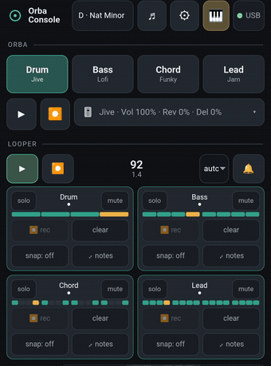
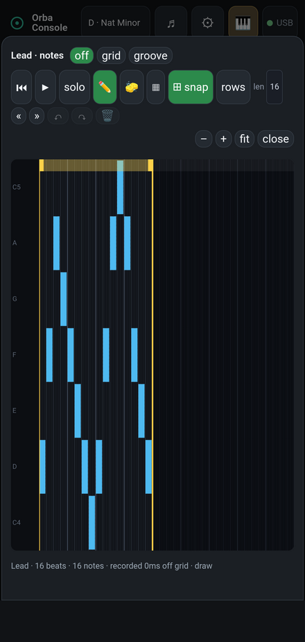
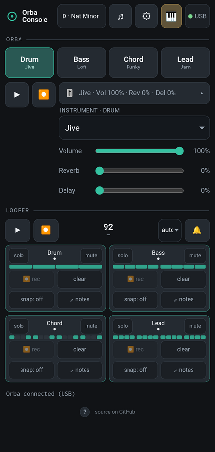
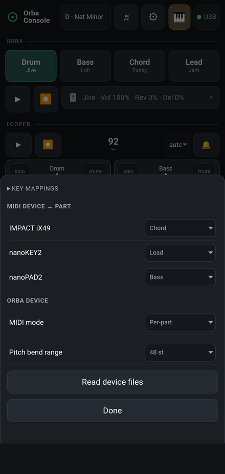
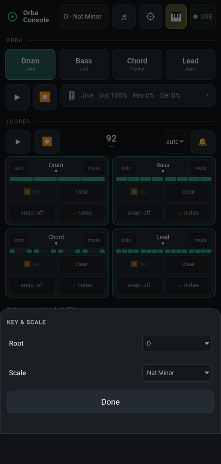
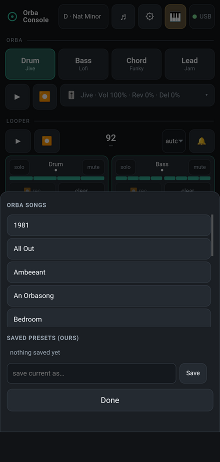

# Orba Console

A browser control surface for the Artiphon Orba. Plug the Orba in over USB, or connect over
Bluetooth, and drive everything the official app used to: instruments and presets, per-part
mix (volume, reverb, delay), tempo, key and scale, quantize. Plus a built-in looper and a
piano-roll note editor.

## Use it

**Live:** https://holofermes.github.io/orba-console/

Open it in a Chromium browser.

## Screenshots

   
  <b>The looper, live.</b> Four tracks at different loop lengths (4, 8, 16, and 16 beats) play together as one polymeter groove, driven here from a phone.

<table>
  <tr>
    <td width="33%" valign="top" align="center">
       
      <b>Note editor</b> 
      Draw, move, and resize notes on a piano roll, with grid snap, box-select, undo, and a movable loop window.
    </td>
    <td width="33%" valign="top" align="center">
       
      <b>Instrument &amp; FX</b> 
      Choose a preset for each part and set its volume, reverb, and delay, all kept in sync with the device.
    </td>
    <td width="33%" valign="top" align="center">
       
      <b>Controller routing</b> 
      Point each USB MIDI controller at its own Orba part, and set the device's MIDI mode and pitch-bend range.
    </td>
  </tr>
  <tr>
    <td width="33%" valign="top" align="center">
       
      <b>Key &amp; scale</b> 
      Set the Orba's root and scale.
    </td>
    <td width="33%" valign="top" align="center">
       
      <b>Songs &amp; presets</b> 
      Load any of the factory songs, or save and recall your own snapshots.
    </td>
  </tr>
</table>

## What's inside

- Per-part instrument and preset switching, mix, tempo, key and scale, and quantize, with
  live two way device sync
- A browser looper that records external MIDI controllers into per track loops (the
  Orba's own looper only records the Orba itself), with polymeter and movable loop windows
- A piano-roll note editor with snap, marquee select, and undo
- An optional key-mapping layer for a hardware controller

## Built on

The protocol is its own project: [orba-protocol](https://github.com/holofermes/orba-protocol),
a spec plus reference libraries. The optional DOIO KB16 controller firmware is
[orba-doio](https://github.com/holofermes/orba-doio).
